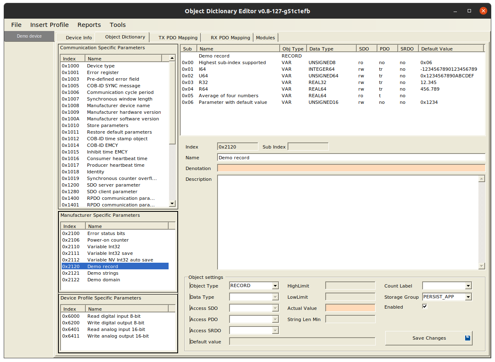

CANopen demoDevice
==================

Demonstration of CANopen device based on [CANopenNode](https://github.com/CANopenNode/CANopenNode), which is free and open source CANopen Stack, based on ([CiA301](http://can-cia.org/standardization/technical-documents)) standard.

demoDevice can run on different target devices. It contains object dictionary with most common communication parameters and some additional manufacturer specific and device profile parameters. Simple example program run from application interface and shows some principles of CANopenNode usage.

Object Dictionary
-----------------
Object Dictionary is central part of CANopen device. It contains well structured communication, manufacturer specific or standardized device profile parameters, accessible by different types of communication. See picture below or complete OD documentation in [demoDevice.md](demoDevice.md). Note also project file `demoDevice.xdd`, which can be opened and edited with EDSEditor.exe (Linux or Windows application). EDSEditor can export other files, including OD.h and OD.c source files for this example. `demoDevice.xdd` and `demoDevice.eds` are standard CANopen device description files and can be opened also with other CANopen tools.

Application interface
---------------------
Entry point into the program is similar to Arduino, extended with CANopen and additional real-time thread. It is similar for all target devices. There are several functions, which are called from main or realtime thread: app_programStart(), app_communicationReset(), app_programEnd(), app_programAsync() and app_programRt(). For details see `CANopenLinux/CO_application.h`. All code must be non-blocking. Application interface for demoDevice is in `CO_application.c` and contains calls to other examples.

### Using global variables directly from Object Dictionary
See `OD.h` for several structures with OD variables. Structures are also used as data blocks, which can be stored into non-volatile memory on SDO command or automatically. Here is example of OD variable, which is incremented on program startup and is stored automatically:

    OD_PERSIST_APP_AUTO.x2106_power_onCounter ++;

### Object oriented access to the OD variable.
`objectAssessOD.h` and .c files contain example of programming style, which is used in all CANopenNode objects. No global variables are used, all used parameters are specified by `objectAccessOD_t` structure. One or multiple objects of type `objectAccessOD_t` are defined externally. This object is also passed as a first argument to all functions inside `objectAssessOD.h`.

#### Initialization of the object
Object is initialized by `objectAccessOD_init()` function. Function accepts second argument `OD_entry_t *OD_demoRecord`, which is entry from Object Dictionary with specified index. In our case it is `Demo record` at index 0x2120, which contains several different sub-entries (see picture above). This OD entry is extended with own IO access functions (`OD_read_demoRecord` and `OD_write_demoRecord`). This means, that every read (SDO, PDO or application) will use our access functions and not the original. (Original access functions reads from or writes to the original memory location, specified by the Object Dictionary.)

#### OD_demoRecord
Subindexes 1 to 4 of the OD_demoRecord contain four "exotic" variables, which can be SDO read, SDO written, or mapped to RPDO or TPDO. They have default value, which is stored in the original memory location. Our IO access functions just redirects to the original access functions, when accessing those subindexes. In initialization phase pointers to those variables are stored for later calculations.

Subindex 5 contains "Average of four numbers". This is read-only parameter and is calculated as average number from subindexes 0..4. In Object Dictionary it does not have default value, so Object Dictionary does not assign memory location for it. Its value is calculated directly inside `OD_read_demoRecord()` function at the moment, it is read (by SDO, TPDO or application). Function objectAccessOD_readAverage() can be used by application for that purpose.

Subindex 6 contains "Parameter with default value". It is meant as parameter for our application, which configures our `internalParameter`. Lets say, our `internalParameter` has units micrometers and "Parameter with default value" has units millimeters. In the initialization phase "Parameter with default value" is read and `internalParameter` is calculated from it. In `OD_read_demoRecord` `internalParameter` is scaled to millimeters and copied to buffer. In `OD_write_demoRecord` value from buffer is scaled to micrometers and written to `internalParameter`. In addition `OD_writeOriginal()` is called, which writes the value also to the original memory location, specified by the Object Dictionary. This is necessary for storage to work.

All values from the OD_demoRecord (except subindex 5) are part of the `OD_PERSIST_APP` structure (see file `OD.h`). This structure is added to the storage module (see file `CO_driver_custom.h`). If any of the values from the OD_demoRecord changes and storage is requested by SDO write (to 0x1010,5 in our case), then values are preserved and are available on the next power-on cycle.

### Device identification
`CO_identificators.h` and .c files contain configuration of CAN bitRate and CANopen nodeId and OD objects 0x1008(manufacturerDeviceName), 0x1009(manufacturerHardwareVersion), 0x100A(manufacturerSoftwareVersion) and 0x1018(identity). `CO_identificators_init()` adds simple OD_extensions to objects containing strings, fills identity values and sets initial values to unconfigured nodeId and bitRate.

Global variables and definitions from `OD.h` are used, which is most simple and good enough in some cases.

### Domain demo
`domainDemo.h` and .c files contain simplified example for CANopen domain data type. With this data type an arbitrary amount of data can be transferred. `domainDemo_init()` adds extension to `OD_ENTRY_H2122_demoDomain` with own `OD_read_domainDemo` and `OD_write_domainDemo` functions. If data size transferred is larger than internal buffer, then those two functions are called several times during SDO data transfer.

#### Reading principle for demonstration
Internal variable `dataSize` configures size of data to be transferred from the device. First data byte transferred has value 0, next 1 and so on sequentially to 255. Next value is 0, then 1 and so on up to `dataSize` bytes transferred.

#### Writing principle for demonstration
Data bytes are received into device, any number of them. For demonstration purposed data bytes are verified: they must be in sequence 0, 1, ..., 255, 0, 1, ... If not, SDO is aborted. If transfer is successfully finished then internal variable `dataSize` is set to number of data bytes transferred.

### OD variable mapped to TPDO triggers its sending
In example we detect change of state of the OD variable. If value changes, then TPDO is triggered, to which that variable is possibly mapped.

`CO_application.c` shows the principle. In configuration phase extension is added to the OD entry with `OD_extension_init()`, then `flagsPDO` are extracted from extension and stored for later use  (`OD_getFlagsPDO()`).

Inside `app_programRt()` function `OD_requestTPDO()` is called on OD variables, when necessary.

If OD variable is mapped to any event triggered TPDO, then TPDO will be automatically sent, as specified in its communication parameters.

Run in Linux
------------
See CANopenLinux/README.md

By default program is compiled without gateway and in double threaded operation (mainline and RT thread). Macro `CO_DRIVER_CUSTOM` is defined, which includes `CO_driver_custom.h` into the foundation of all source files.

Note that several `*.persist` files are created in directory, from which `demoLinuxDevice` runs. These are files, which stores data blocks (from Object Dictionary). Directory for storage files can also be specified by program arguments. Each CANopen Linux device must use own directory for storage files.

    cd demo
    make
    ./demoLinuxDevice can0 -i 4

Run in PIC32
------------
See CANopenPIC/README.md

Program runs in Arduino style [Max32 board](https://reference.digilentinc.com/reference/microprocessor/max32/start) with [PIC32MX795F512L](https://www.microchip.com/wwwproducts/en/PIC32MX795F512L) Microcontroller or in Explorer16 board. Prepare device as specified in CANopenPIC/README.md. Load demoDevice program, and connect to CANopen Network. Device runs with 250kbps with NodeId=4. First initialize the eeprom:

    cocomm "4 w 0x1011 1 vs load"
    cocomm "4 reset node"
    cocomm "4 w 0x1010 1 vs save"
    cocomm "4 reset node"

Device has some peripherals enabled by default:
 - chipKIT Pins 0..7 are used as digital inputs, TPDO1 sends them on change-of-state.
 - chipKIT Pins A0..A15 are used as analog inputs, TPDO2 sends four of them if event timer is configured (`cocomm "4 w 0x1801 5 u16 500"`).

Testing with SDO and PDO
------------------------
See [tutorial/README.md](../tutorial/README.md), chapter Next steps.
